# DanHak Grocery - Walkthrough

This guided tour explains how to spin up the grocery storefront, exercise the most important user journeys, and capture the right screenshots for demos or documentation. Follow every step in order when you onboard a new teammate or hand the project over to QA.

## 1. Environment Prep

1. **Clone and install prerequisites**  
   ```bash
   git clone <repo-url>
   cd MySql-NodeGroceryStore
   # Ensure Docker Desktop is running
   ```
   Open the folder in your favorite editor so you can watch console logs as you go.

2. **Boot the stack**  
   ```bash
   docker compose up -d
   docker compose ps            # confirm node + cosc304-sqlserver are healthy
   ```
   The Node container hot-reloads off the `www` bind mount, so edits take effect instantly.

3. **Seed SQL Server (optional reset)**  
   ```bash
   docker compose exec cosc304-sqlserver /opt/mssql-tools18/bin/sqlcmd \
     -C -S localhost -U sa -P '304#sa#pw' \
     -i /scripts/SQLServer_orderdb.ddl
   ```
   Run this whenever you want a clean database state before demoing.

4. **Visit the app**  
   Open http://127.0.0.1 in a browser (or http://159.203.4.6 for the hosted droplet) to verify the landing page renders without console errors.

## 2. Shopper Journey (Screens + Narrative)

Each subsection mirrors what an end user would do. Capture the matching screenshot if you update the UI so the walkthrough stays fresh.

### Step 1. Welcome Home
The home hero introduces DanHak Grocery with clear CTA buttons for shopping, viewing the cart, jumping to customer info, and navigating to admin screens. Confirm that the nav bar reflects the login state (anonymous greeting on first load).

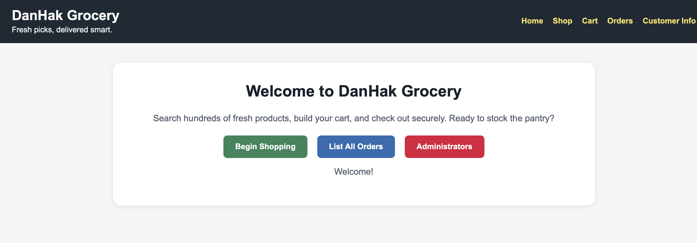

### Step 2. Log in from the Customer CTA
Use the *Customer Info* button to access the login form, then sign in with `arnold/test`. Successful authentication stores the session and unlocks protected routes.

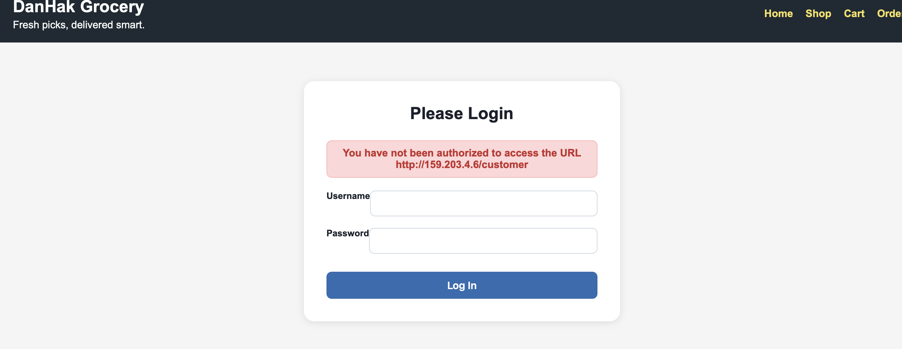

After logging in, the customer dashboard echoes stored profile data, confirming DB connectivity.

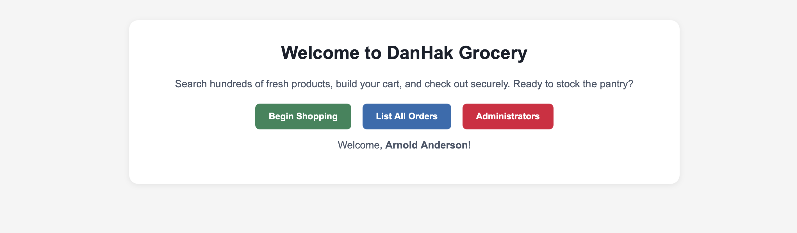

**Common test users**

| customerId | userid  | password |
| ---------- | ------- | -------- |
| 1          | arnold  | test     |
| 2          | bobby   | bobby    |
| 3          | candace | password |
| 4          | darren  | pw       |
| 5          | beth    | test     |

### Step 3. Begin Shopping
Return to the landing page and click *Begin Shopping*. The CTA routes to `/listprod` and shows the catalog filters. The screenshot below highlights the call-to-action button so stakeholders recognize the entry point.

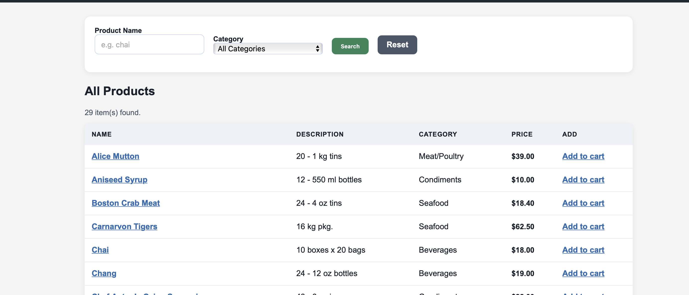

### Step 4. Find Items
Search for favorites such as chai or mutton using the name box and optional category dropdown. Verify that result counts update as you type, and that each row exposes a product link plus the *Add to cart* action.

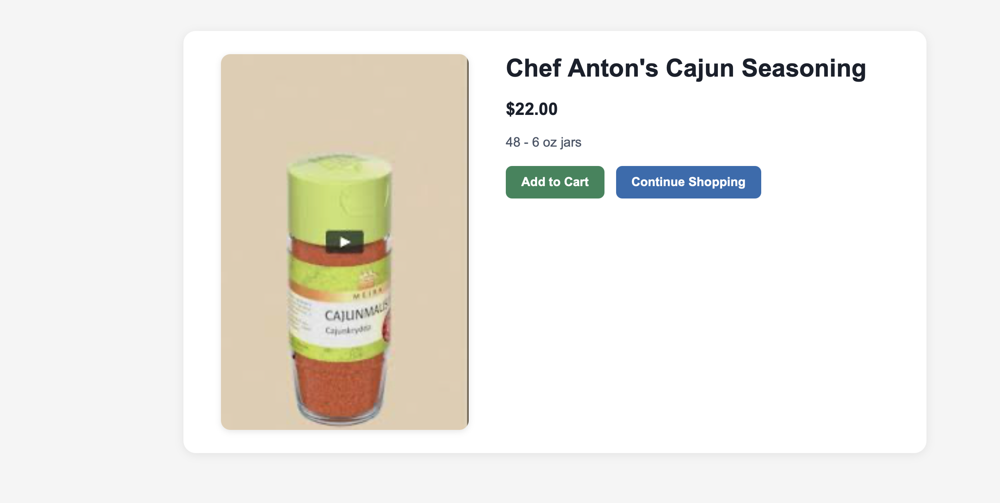

### Step 5. Manage the Cart
After adding products, open `/showcart` to review every line item. Update quantities, remove a product, and watch the totals recalculate. If you empty the cart, the UI surfaces an encouraging prompt to start shopping again.

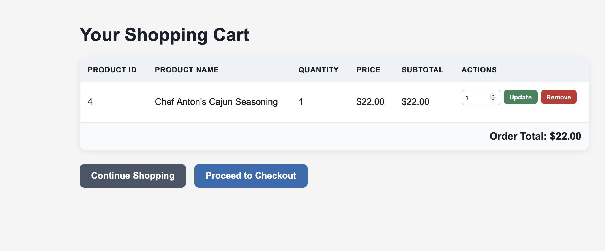

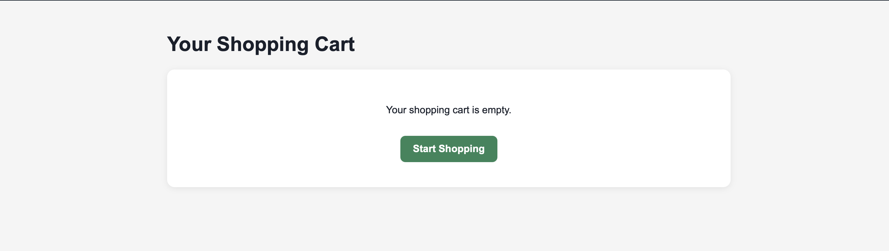

### Step 6. Secure Checkout
Click *Proceed to Checkout*. Even if you are logged in, the system enforces a credential recheck to prevent session hijacking. Enter the same customer ID and password to continue.

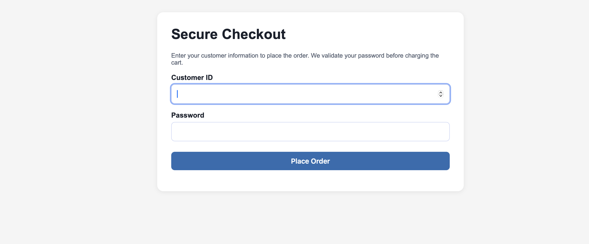

### Step 7. Review the Order Summary
`/order` validates the cart, inserts an order, and displays an itemized confirmation card that mirrors the DB records. Use this screen to confirm totals and the new order ID.

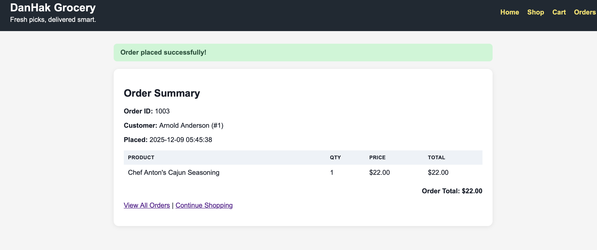

### Step 8. Inspect Order History
Navigate to `/listorder` to ensure the newly placed order is now visible. Apply filters, check timestamps, and expand each accordion to verify product line items.

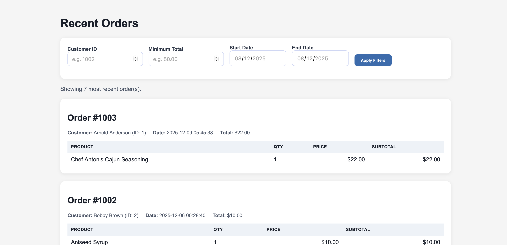

### Step 9. Admin Reporting
Authenticated users can open `/admin` to review daily sales aggregation. This report proves that statistics roll up as expected and that restricted pages honor the auth guard.

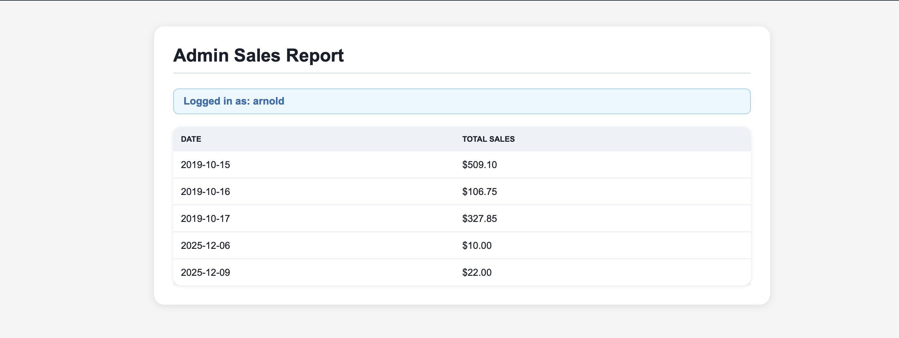

## 3. Troubleshooting and Shutdown

- **Stack issues** - `docker compose logs -f node` and `docker compose logs -f cosc304-sqlserver` reveal connection or query errors. Fix code and refresh the browser.
- **Login failures** - Rerun the helper query in `TEST_GUIDE.md` to list seeded users and passwords whenever credentials drift.
- **Stopping services** - Tear down the environment when finished:
  ```bash
  docker compose down
  docker compose down -v   # also drop SQL volumes when you want a clean slate
  ```

Document any anomalies you encounter inside `TEST_GUIDE.md` so QA and stakeholders can track regressions over time.
